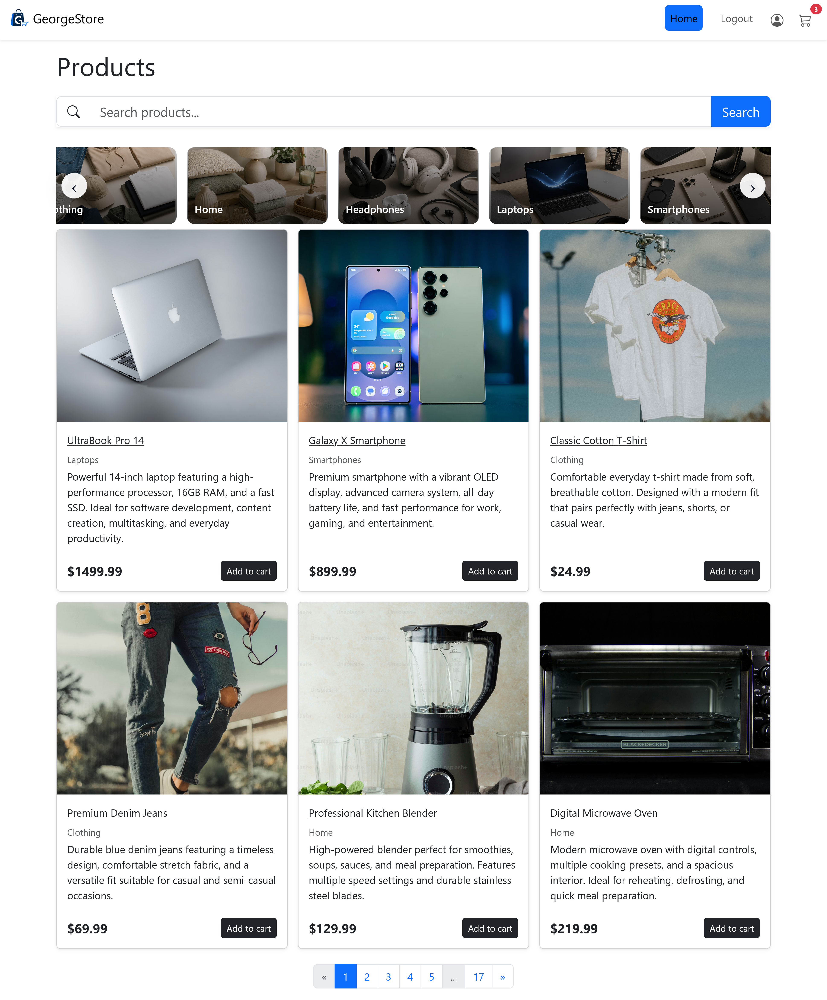
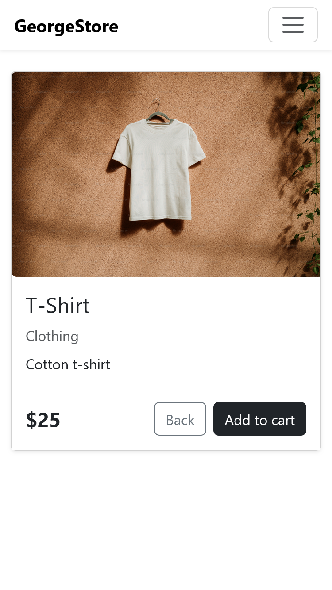
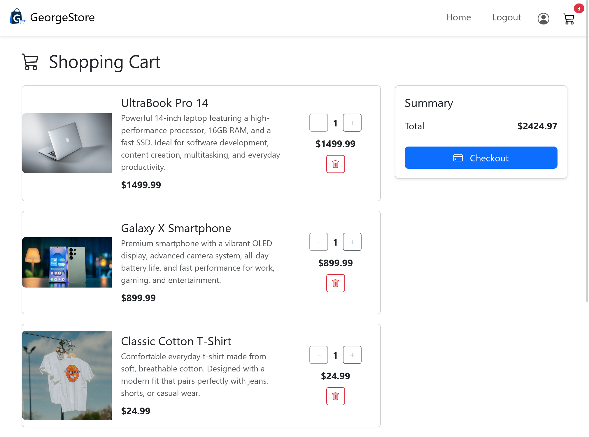
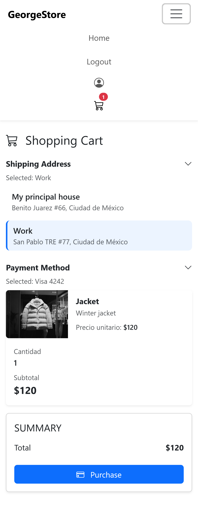
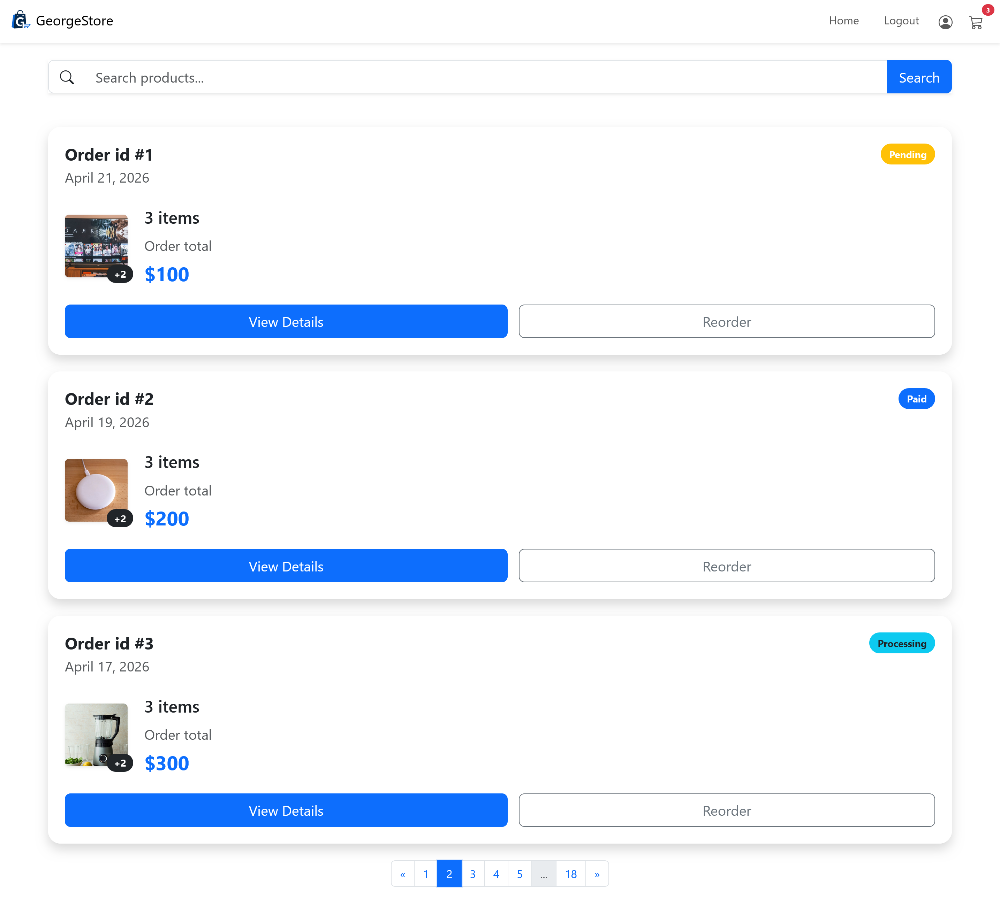
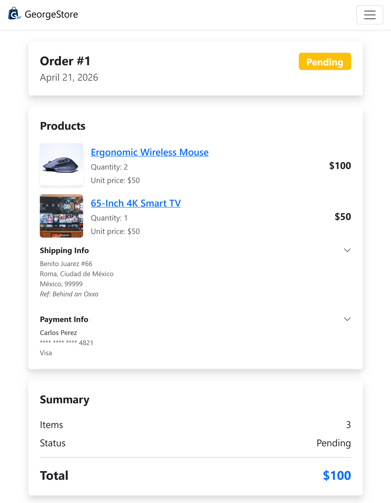
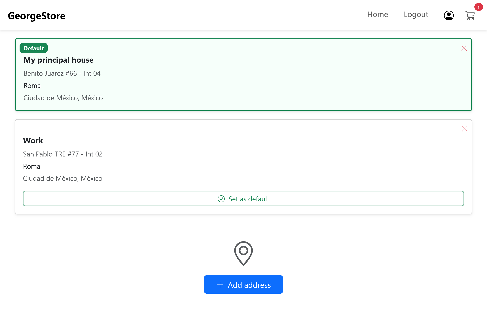
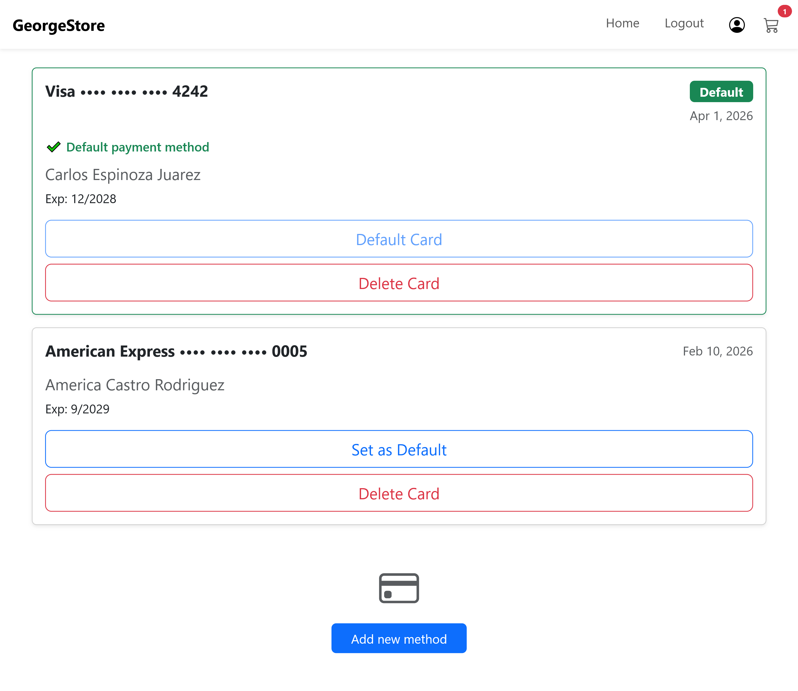
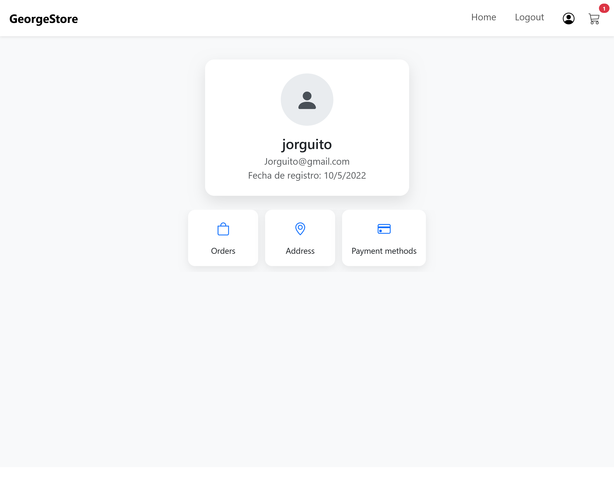
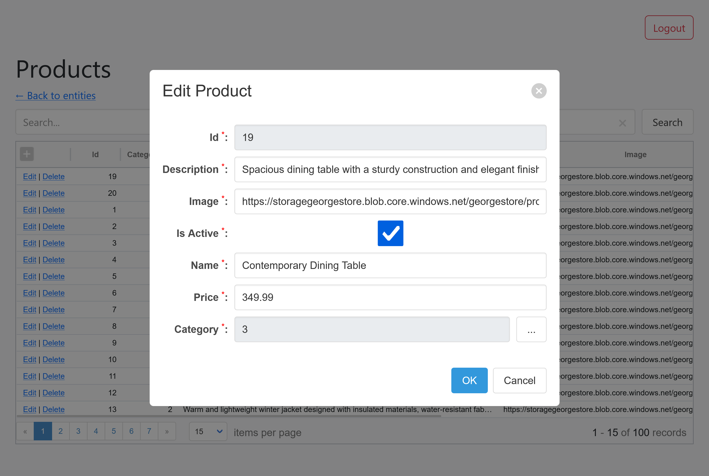

# GeorgeStore Frontend

[](https://jorgegerardo.github.io/GeorgeStoreClient/)

[](https://georgestore-gwemdwb0gnhhb0ha.canadacentral-01.azurewebsites.net/swagger/index.html)

[](https://github.com/JorgeGerardo/GeorgeStoreAPI)


Aplicación frontend para una plataforma E-Commerce Full Stack desarrollada con Angular.

GeorgeStore permite a los usuarios explorar productos, administrar su carrito de compras, realizar pedidos, guardar direcciones y métodos de pago, además de gestionar la información de su cuenta mediante una interfaz moderna y responsiva.

---

## Características

- Búsqueda de productos con filtros y paginación
- Funcionalidad de carrito de compras
- Creación y reordenamiento de pedidos
- Autenticación de usuarios mediante JWT
- Recuperación de contraseñas mediante envío de correo electrónico
- Protección de rutas con Route Guards
- Manejo automático de JWT mediante HTTP Interceptors
- Spinners de carga para peticiones asíncronas
- Administración de direcciones (CRUD)
- Administración de tarjetas de crédito (CRUD)
- Sección de perfil de usuario
- Diseño responsivo
- Arquitectura organizada por características (features)

---

## Arquitectura

El proyecto está organizado por características para mejorar la escalabilidad y el mantenimiento del código.

```txt
auth/
products/
orders/
profile/
cart/
Core/
```

Cada característica contiene su propia lógica, componentes, modelos y servicios de manera modular.

---

## Autenticación

La autenticación se maneja mediante JWT almacenados en cookies.

La aplicación utiliza HTTP Interceptors para adjuntar automáticamente los tokens a las peticiones protegidas y manejar la comunicación autenticada con la API.

También cuenta con recuperación de contraseñas mediante correo electrónico.

---

## Tecnologías

### Frontend

- Angular
- TypeScript
- RxJS
- Bootstrap
- SCSS

### Conceptos y Patrones

- Arquitectura por características (Feature-based architecture)
- Route Guards
- HTTP Interceptors
- Programación reactiva con RxJS
- Paginación y filtrado
- Estructura modular de componentes

---

## Capturas

### Inicio



### Detalle de producto



### Carrito de compras



### Realizar compra



### Pedidos



### Detalle de pedido



### Direcciones



### Métodos de pago



### Perfil de usuario



### Panel administrativo


---


## Backend 

Este frontend consume una API REST desarrollada con ASP.NET Core:
https://github.com/JorgeGerardo/GeorgeStoreAPI

